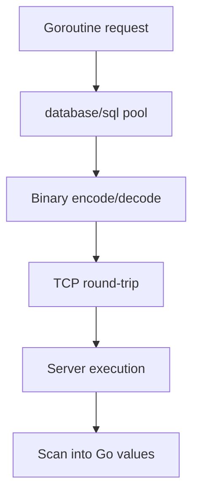
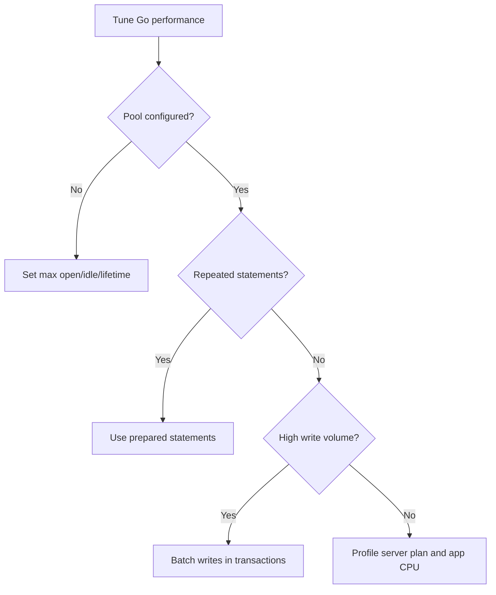

# Performance Guide

This guide summarizes `cubrid-go` benchmark behavior and optimization recommendations.

---

## Table of Contents

- [Overview](#overview)
- [Benchmark Results](#benchmark-results)
- [Performance Characteristics](#performance-characteristics)
- [Optimization Tips](#optimization-tips)
- [Running Benchmarks](#running-benchmarks)

---

## Overview

`cubrid-go` is a pure Go `database/sql` driver for CUBRID using the CAS binary protocol.

---

## Benchmark Results

Source: [cubrid-benchmark](https://github.com/cubrid-labs/cubrid-benchmark)

Environment: Intel Core i5-9400F @ 2.90GHz, 6 cores, Linux x86_64, Docker containers.

Workload: Go `cubrid-go` vs `go-sql-driver/mysql`, 1000 rows x 5 rounds.

Observed outcome: near parity (approximately 1:1 ratio) across common CRUD benchmark scenarios.

---

## Performance Characteristics

- Benchmarks show CUBRID and MySQL drivers performing at near parity in Go workloads.
- Go's goroutine scheduler and `database/sql` pooling provide efficient concurrency.
- CAS binary protocol overhead is low relative to application and server execution time.
- Throughput scales well when connection limits and transaction size are tuned.

---

## Optimization Tips

- Tune pool controls: `SetMaxOpenConns`, `SetMaxIdleConns`, and `SetConnMaxLifetime`.
- Reuse prepared statements for repeated query shapes.
- Batch writes inside transactions to reduce commit overhead.
- Keep scan targets concrete and avoid unnecessary type conversions.

---

## Running Benchmarks

1. Clone `https://github.com/cubrid-labs/cubrid-benchmark`.
2. Start benchmark databases with Docker per repository documentation.
3. Run the Go benchmark suite (`cubrid-go` vs `go-sql-driver/mysql`).
4. Use 1000 rows x 5 rounds to mirror the published parity run.
5. Compare scenario-level timing and compute ratios from exported results.

Follow benchmark repo scripts for exact command invocations.
